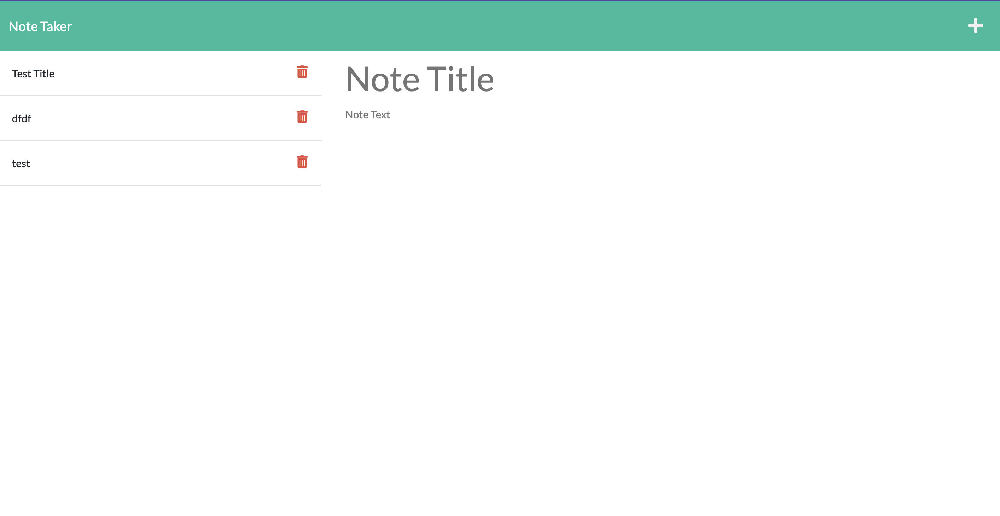

# Note Taker
This is a simple note taking app built with Node.js and Express. It allows users to create, view, update, and delete notes.

## Deployed App
[Note Taker](https://guarded-hamlet-07251.herokuapp.com/)

## Mock-up Image

## Installation
To install the app, 
* Clone the repository
* Run npm i
* npm start

## License
This app is licensed under the MIT License.